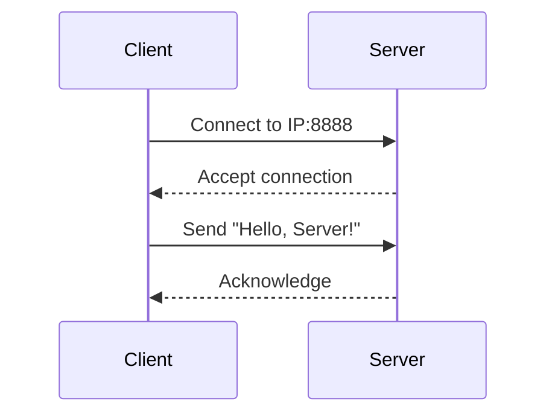

# Simple Client-Server Communication App
This is a simple Android app demonstrating client-server communication via sockets.
This Android app also demonstrate a simple realtime communication, like a chat app.

## Tech Stack
List of technologies used:
* **Language:** Kotlin
* **UI Framework:** Jetpack Compose
* **IDE:** Android Studio

## 🎯 Purpose
Learn how to:  
- Create a server socket to listen for incoming connections.  
- Establish a client socket to send/receive messages.
- Handle network operations on background threads.  

## ⚙️ Setup
1. Clone this repository:
```
git clone https://github.com/DevDomingoJohn/SCA.git
```
2. Open in Android Studio (Latest Version)
3. Run the app on two devices:
    * Launch the server on Device A
    * Launch the client on Device B

## 🚀 Usage
1. **Send a message:** Both client socket and sever socket can send a text to each other.
2. **Receive a message:** Both client socket and server socket displays text from each other.

## 📄 Key Code Snippets
**Server Socket (Kotlin)**

Starting Server
```kotlin
private lateinit var serverSocket: ServerSocket
private lateinit var outputStream: OutputStream
private val isRunning = AtomicBoolean(true)

fun start() {
    Thread {
        try {
            serverSocket = ServerSocket(port)
            addLog("Started Server on port: $port")

            while(isRunning.get()) {
                val socket = serverSocket.accept() // Blocks until a client connects
                if (socket.isConnected) {
                    addLog("${socket.inetAddress.hostAddress} Joined The Server")

                    outputStream = socket.getOutputStream()
                    val server = "Welcome To Soul Society!"
                    outputStream.write(server.toByteArray())
                    outputStream.flush()
                }

                Thread {
                    handleClient(socket) // Handles client on different thread
                }.start()
            }
        } catch (e: IOException) {
            e.printStackTrace()
        }
    }.start()
}
```
Client Handling
```kotlin
private fun handleClient(client: Socket) {
    try {
        val inputStream = client.getInputStream()

        while(isRunning.get()) { // Recieve multiple messages as long as the server is running
            val buffer = ByteArray(1024)
            val bytesRead = inputStream.read(buffer) // Blocks until messages comes
            if (bytesRead == -1) break // Break when client disconnects
            val message = String(buffer,0,bytesRead)
            addLog("${client.inetAddress.hostAddress}: $message")
        }
    } catch (e: IOException) {
        e.printStackTrace()
    } finally {
        client.close()
        addLog("${client.inetAddress.hostAddress} Disconnected!")
    }
}
```
Sending Messages
```kotlin
fun message(text: String) {
    Thread {
        try {
            outputStream.write(text.toByteArray())
            outputStream.flush()
        } catch (e: IOException) {
            e.printStackTrace()
        }
    }.start()
}
```
Stopping Server
```kotlin
fun stop() {
    isRunning.set(false)

    try {
        serverSocket.close()
    } catch (e: IOException) {
        e.printStackTrace()
    }
}
```
---
**Client Socket (Kotlin)**

Connect to Server
```kotlin
private lateinit var socket: Socket
private lateinit var outputStream: OutputStream
private val isConnected = AtomicBoolean(false)

fun connect() {
    Thread {
        try {
            socket = Socket(ip,port)
            isConnected.set(true)

            outputStream = socket.getOutputStream()
            val inputStream = socket.getInputStream()

            while(isConnected.get()) { // Recieve multiple messages as long as client is connected to ther server
                val buffer = ByteArray(1024)
                val bytesRead = inputStream.read(buffer) // Blocks until message comes
                if (bytesRead == -1) break // Break when server stopped
                val message = String(buffer,0,bytesRead)
                addLog("${socket.inetAddress.hostAddress}: $message")
            }
        } catch (e: IOException) {
            e.printStackTrace()
        } finally {
            disconnect() // Call disconnect function to close the socket after the server stopped
        }
    }.start()
}
```
Sending Messages to the Server
```kotlin
fun message(text: String) {
    Thread {
        try {
            outputStream.write(text.toByteArray())
            outputStream.flush()
        } catch (e: IOException) {
            e.printStackTrace()
        }
    }.start()
}
```
Disconnecting from the server
```kotlin
fun disconnect() {
    if (isConnected.get()) {
        try {
            socket.close()
        } catch (e: IOException) {
            e.printStackTrace()
        }
        addLog("You Disconnected From The Server")
        isConnected.set(false)
    }
}
```

## ❓ Common Issues
- **Connection refused:** Ensure the server is running first.
- **Network permission:** Add <uses-permission android:name="android.permission.INTERNET" /> to AndroidManifest.xml.
- **Not on the same network:** Client and server must be on the same LAN/Wi-Fi.

## 🔍 Learn More
- [Android Networking Guide](https://developer.android.com/develop/connectivity)
- [Java Sockets Tutorial](https://docs.oracle.com/javase/tutorial/networking/sockets/)

## Visual Diagrams

