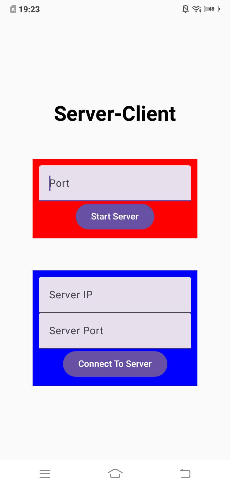
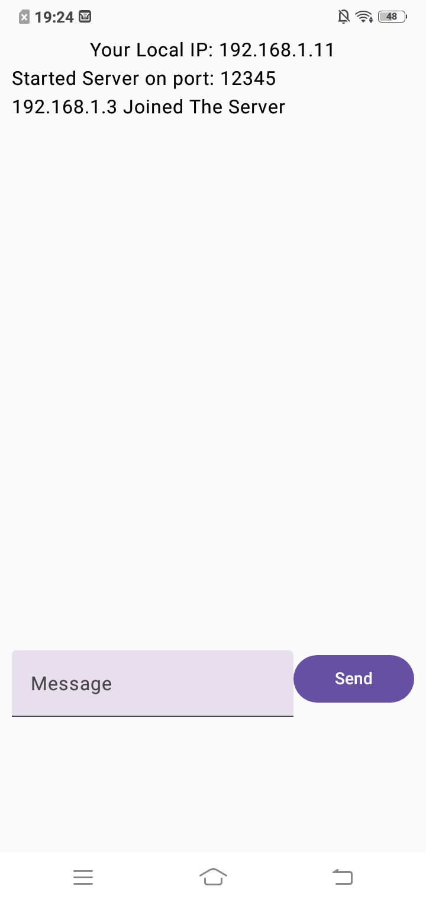
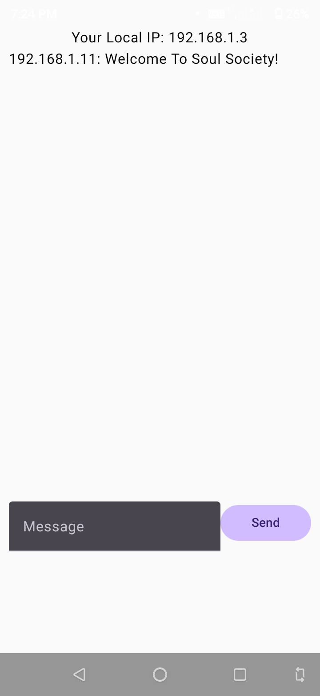

# Simple Client-Server Communication App
This is a simple Android app demonstrating client-server communication via sockets.
This Android app also demonstrate a simple realtime communication, like a chat app.

## Tech Stack
List of technologies used:
* **Language:** Kotlin
* **UI Framework:** Jetpack Compose
* **IDE:** Android Studio

## 🎯 Purpose
Learn how to:  
- Create a server socket to listen for incoming connections.  
- Establish a client socket to send/receive messages.
- Handle network operations on background threads.  

## ⚙️ Setup
1. Clone this repository:
   ```
   git clone https://github.com/DevDomingoJohn/SCA.git
   ```
2. Open in Android Studio (Latest Version)
3. Run the app on two devices:
    * Launch the server on Device A
    * Launch the client on Device B

## 🚀 Usage
1. **Send a message:** Both client socket and sever socket can send a text to each other.
2. **Receive a message:** Both client socket and server socket displays text from each other.

## 📱 Screenshots
| Home Screen | Server Screen | Client Screen |
|---------------|---------------|---------------|
|  |  | 

## 🧪 Quick Testing
1. **Server-side**:  
   - Enter port and start server and wait for the log: "Server started on port 8888".  
2. **Client-side**:  
   - Enter the server’s local IP and port where the server is listening for incoming connections.

## 📄 Key Code Snippets
**Server Socket (Kotlin)**

```kotlin
serverSocket = ServerSocket(port)
addLog("Started Server on port: $port")

// Main accept loop - runs until stop() is called
while(isRunning.get()) {
   val socket = serverSocket.accept()

   // Capacity control: Only allow one client
   if (clientSockets.isNotEmpty()){
      // Immediately reject new connections when full
      val tempOutputStream = socket.getOutputStream()
      val server = "Server is Full!"
      tempOutputStream.write(server.toByteArray())
      tempOutputStream.flush()
      socket.close()
      continue // Skip to next accept() call
   }

   addLog("${socket.inetAddress.hostAddress} Joined The Server")
   clientSockets.add(socket)

   // Start client handler thread
   Thread {
      handleClient(socket)
   }.start()
}
```
[For Full Details About Server Socket Implementation](docs/ServerSocket.md)

**Client Socket (Kotlin)**

```kotlin
// Create socket connection (blocks until connected or timeout)
socket = Socket(ip,port)
isConnected.set(true)

// Set up output stream for sending messages
outputStream = socket.getOutputStream()

// Start message reception loop
val inputStream = socket.getInputStream()
while(isConnected.get()) {
   val buffer = ByteArray(1024) // Fixed-size receive buffer
   val bytesRead = inputStream.read(buffer) // Blocks until data receive

   if (bytesRead == -1) break // Server closed connection

   val message = String(buffer,0,bytesRead)
   addLog("${socket.inetAddress.hostAddress}: $message")
}
```
[For Full Details About Client Socket Implementation](docs/ClientSocket.md)

## ❓ Common Issues
- **Connection refused:** Ensure the server is running first.
- **Network permission:** Add <uses-permission android:name="android.permission.INTERNET" /> to AndroidManifest.xml.
- **Not on the same network:** Client and server must be on the same LAN/Wi-Fi.

## 🔍 Learn More
- [Android Networking Guide](https://developer.android.com/develop/connectivity)
- [Java Sockets Tutorial](https://docs.oracle.com/javase/tutorial/networking/sockets/)
